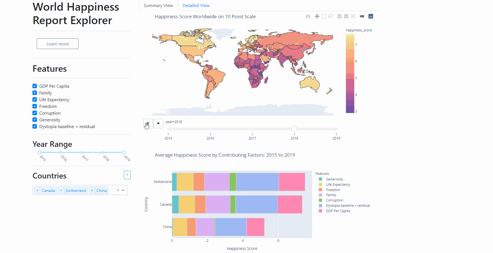

# *happy-dash*

An interactive exploration of the data from the [World Happiness Report](https://worldhappiness.report/) for 2015 - 2019. 

Heroku app [here](https://happydash.herokuapp.com/).

### Research question:

How have overall happiness and factors that contribute to overall happiness changed on a global level and on national levels over time?

### Demo



### Description of Dashboard Design
This dashboard is to compare happiness across multiple countries over time.
The dashboard is divided into two main screens: a summary view and a detailed view.
Both screens have some aspects in common: they  both contain a menu that  allow the user of the dashboard to select the features they want to analyze as well as the countries they want to compare. For both screens the majority of the screen displays visuals and the user is able to select the year range for the visuals as well as contributing factors and countries.

#### Detailed View


In detailed view, the user is able to select all features and any desired countries. On the visual section, they are shown up to 8 line charts. The first and central one will display happiness scores over time by country. The other line charts are charts of the individual features and  appear below the central chart. There will be a legend displaying the country or continent names as well as the corresponding colours for each.

#### Summary View


In the overview, in the menu the user can select all or a certain number of features. This also applies to countries. In the visual section there is two charts, one summary chloropleth of the world and one stacked bar chart by country. The map can be animated over the time range selected to visually see patterns by large areas. The stacked bar chart averages all components of a country's happiness score to give an idea of relative contribution over the time range selected.

### Running Locally:

To run this app locally and modify it - first clone this repo:

```bash
$ git clone https://github.com/UBC-MDS/happy-dash.git
```

Setup a conda env for it, and activate it using the following commands from the root of the project on your computer:

```bash
$ conda env create
$ conda activate happydash
```

Finally, run the app with:

```bash
$ python src/app.py
```


